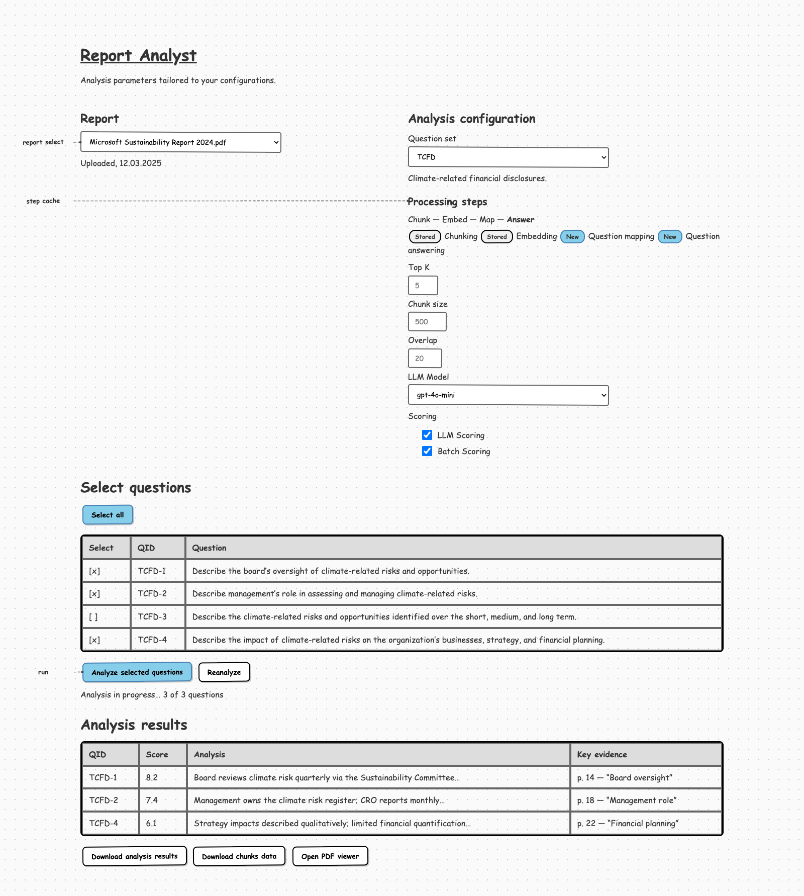
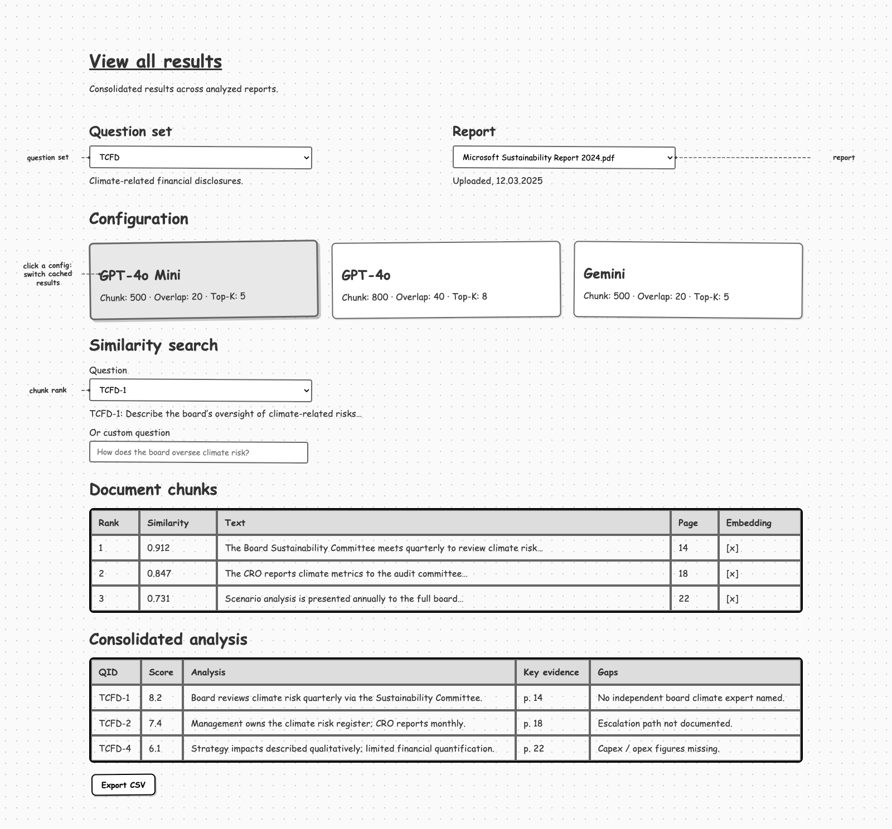
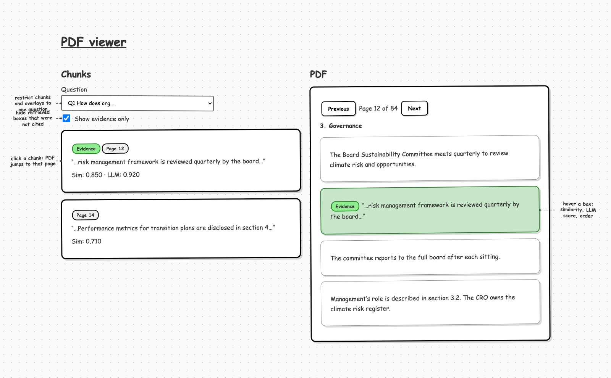
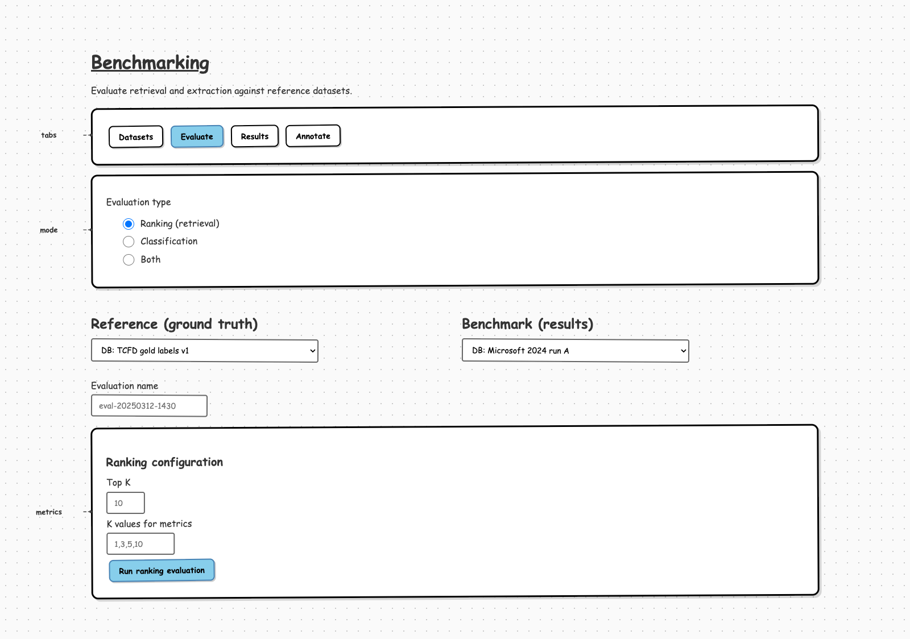

# Report Analyst wireframes

Sketch screens of the Report Analyst UI (no CT Platform chrome). GitHub renders the PNGs below.

Syntax that these pages use (`{#id}`, `::: callout`, PDF overlays, selected config cards) lives in the [devolute/wiremd](https://github.com/devolute/wiremd) fork, branch [`feat/callouts`](https://github.com/devolute/wiremd/tree/feat/callouts).

```bash
npm install github:devolute/wiremd#feat/callouts
```

## Analysis



[Source](pages/analysis.md) · [HTML](out/analysis.html)

## View all results



[Source](pages/view-all-results.md) · [HTML](out/view-all-results.html)

## PDF viewer



[Source](pages/report-viewer.md) · [HTML](out/report-viewer.html)

## Benchmarking



[Source](pages/benchmarking.md) · [HTML](out/benchmarking.html)

## Rebuild

Edit a page under `pages/`, then from a checkout of [devolute/wiremd@feat/callouts](https://github.com/devolute/wiremd/tree/feat/callouts):

```bash
npm run build
node bin/wiremd.js /path/to/report-analyst/docs/wireframes/pages/analysis.md \
  -s sketch -o /path/to/report-analyst/docs/wireframes/out/analysis.html
```

Repeat for `view-all-results`, `report-viewer`, and `benchmarking`. Recapture PNGs into `renders/` if the figure should update on GitHub.
